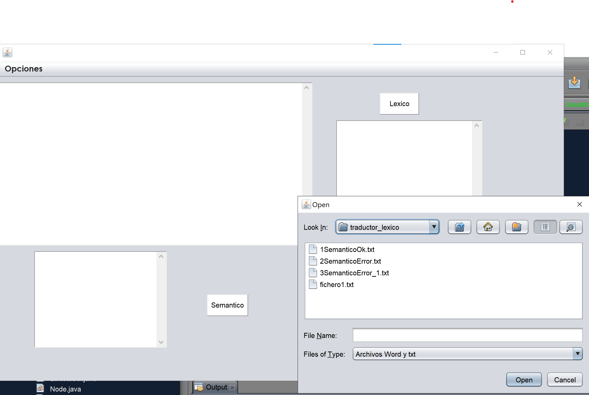
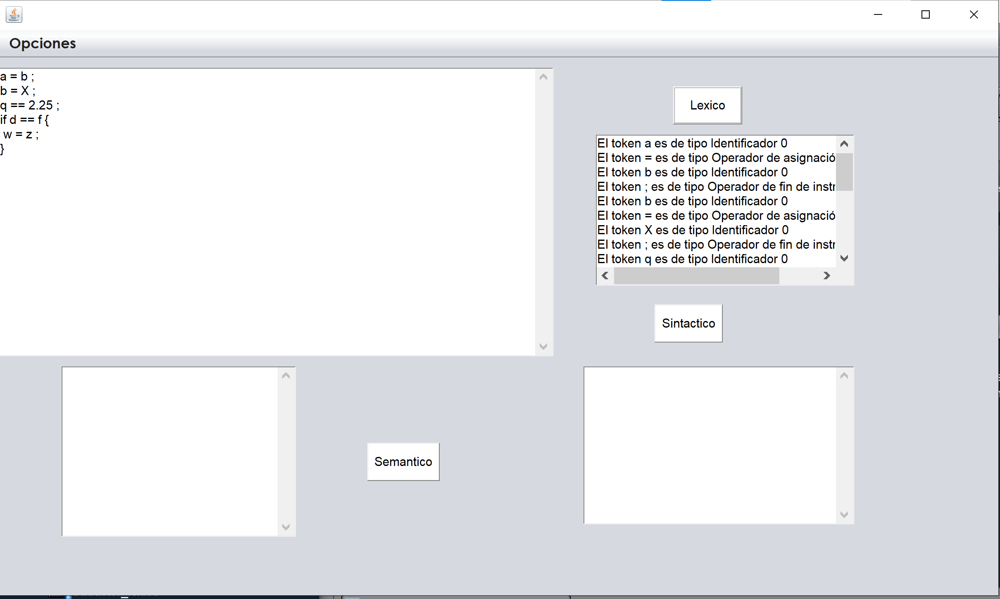
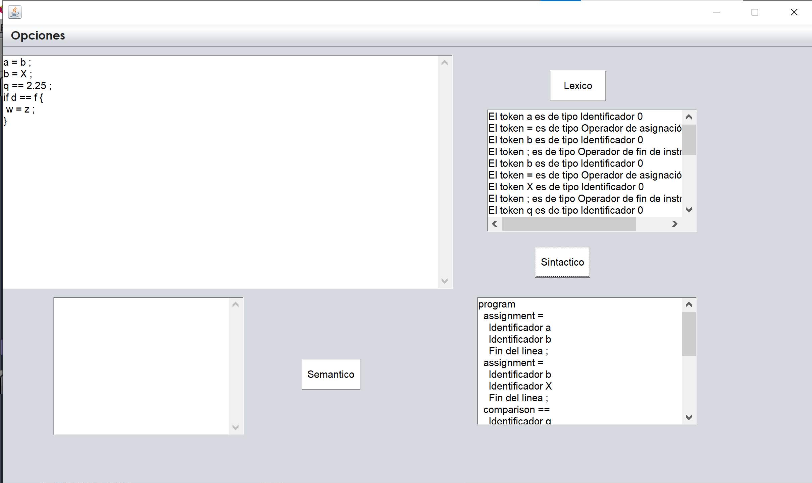
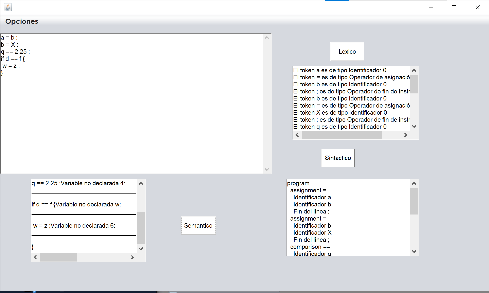

# This project is a compiler made in Java

This project is a compiler in Java ,in my translators class i needed to create an simple compilar with three buttons that can analyze the semantic , lexical and syntatic aspects of the text

## Features

- **You can create a new text or select a predetermined txt**
- **You can check the text using the Semantic, Lexical, and Syntactic buttons**

## Getting Started

### Prerequisites
- Java Development Kit (JDK)
- NetBeans IDE
## Project images

  
  
  
    
      
    
